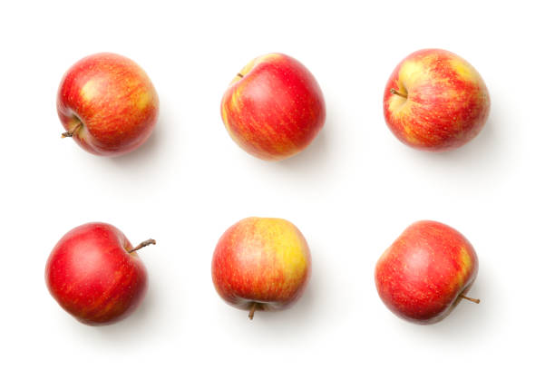
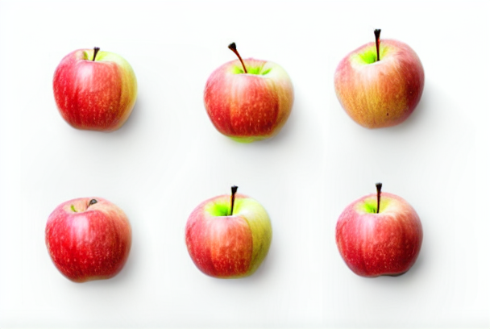
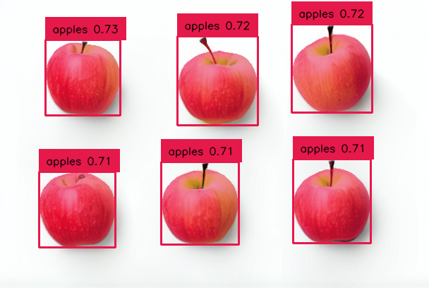

## StabledGroundingSAM

This package takes an image and a text file containing the names of objects of interest and generates new images using stable diffusion. In the next step, grounding Dino detects the objects in the images and draws a bounding box around them. This is then the input to segment anything, which generates a segmentation mask. The generated dataset is saved in the yolo format.
## 💻 Install

Pip install the requirements in a
[**3.11>=Python>=3.7**](https://www.python.org/) environment.

```bash
pip install -r requirements.txt
```

## 🌀 Results
**Input prompt:** apple

**Input image:** 



**Stable Diffusion image:**       **Segmented image:**
<div style="display: flex;">
  
  
</div>

## 🔥 Quickstart


Clone the StabledGroundingSAM repository from GitHub.

```bash
git clone https://github.com/Marco2929/StabledGroundingSAM.git
```

Change the current directory to the StabledGroundingSAM folder.

```bash
cd StabledGroundingSAM/
```


Clone the GroundingDINO repository from GitHub and follow the instructions there.

```bash
git clone https://github.com/IDEA-Research/GroundingDINO.git
```

Download the weights of segment anything and groundingDINO (If not already done) and move them in the weights folder

```bash
mkdir weights
cd weights
wget -q https://github.com/IDEA-Research/GroundingDINO/releases/download/v0.1.0-alpha/groundingdino_swint_ogc.pth
wget -q https://dl.fbaipublicfiles.com/segment_anything/sam_vit_h_4b8939.pth
```

Add a classes.txt file which contains the objects you want to label.
Run program with providing the location of the classes.txt file, the initial image and how many pictures the model should generate.
```bash
python -m main <class.txt location> <initial image location> <number of pictures>
```

## 🔧 Adjustables

There are many optional arguments which make it possible to adjust the output of the models.
### Stable Diffusion:
`--diffusion_prompt:` Provide different prompt to stable diffusion (by default classes.txt)

See stable diffusion documentation

`--guidance_scale`

`--strength`

### Grounding-Dino:

See Grounding-Dino documentation

`--box_threshold`

`--text_threshold`
### Segment Anything (only available in the yolo dataset):
Mask will not be used if it's over or under this percentage, useful to finetune segmentation.

`--min_image_area_percentage`

`--max_image_area_percentage`

`--approximation_percentage: `Changes the sharpness of mask.
